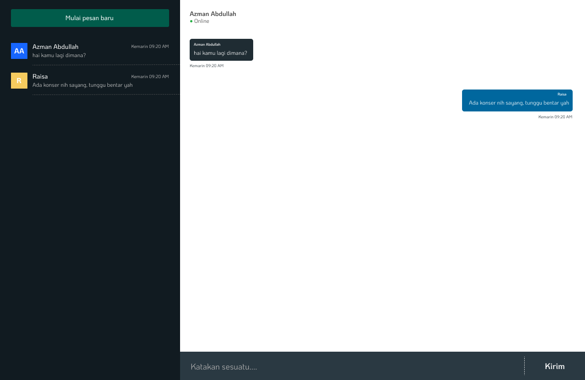

## Overview
Whatapps clone via websocket, html css js. 
> The project was created for learning purposes

## Install
* [Local](docker)
* [Docker](Docker)


### Local
1. Prerequisite project
  * Download [NodeJS](https://nodejs.org/en) and then install NodeJS installer

  * Download [Git](https://www.git-scm.com/) and then install installer

2. Download project via Git
```bash
git clone https://github.com/azmanabdlh/whatsapp-html-clone.git
```
3. Another option you can download manual this project via github.com.

4. Open code editor `Visual Studio Code`, add project with drag and drop on your code editor.

5. Running the command
```bash
// install dependencies
1. make dep 

// compile script
2. make compile
// or using live compile
3. make serve-compile
```

4. Open your browser (Chrome) and drag and drop index.html in  `/packages/browser/public` . But when using `serve-compile`, open `localhost:9191`.

5. Client done


6. Running server
```bash
make serve-websocket
```

7. Open browser and open `localhost:8181`

8. Server done

### Docker
1. Please install [Docker](https://www.docker.com/)
2. After then install the Docker Installer
3. Running the commmand
```bash
make compose
```
4. Open browser and open link
```bash
localhost:80 -> client
localhost:8181 -> server
```
5. Done